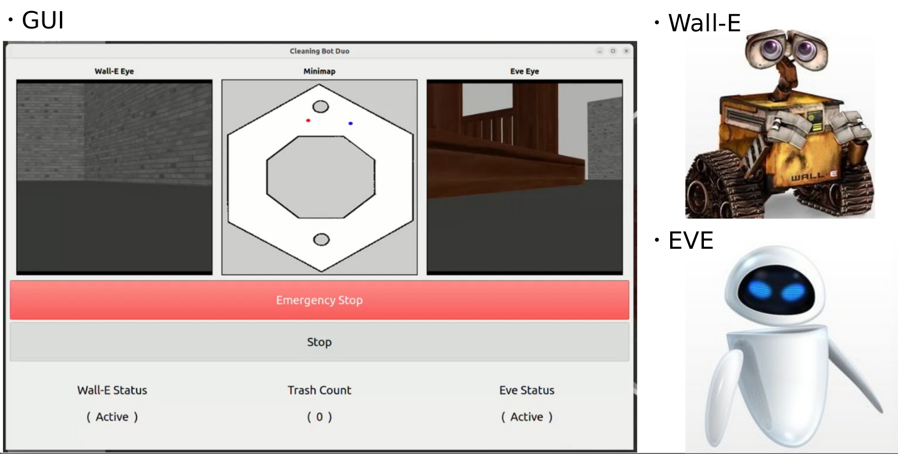
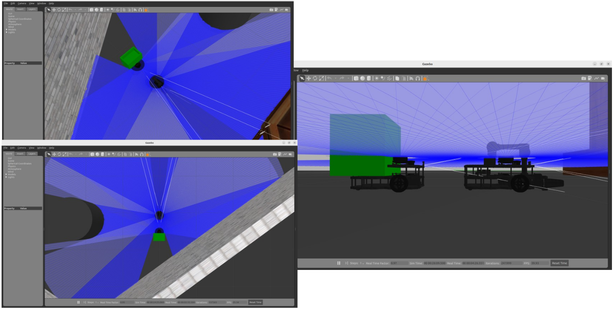
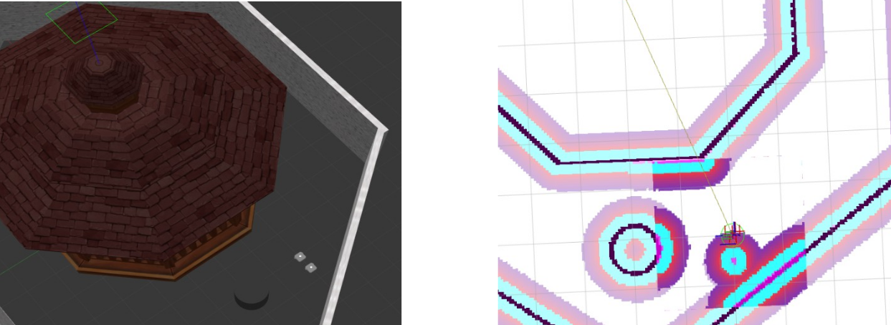
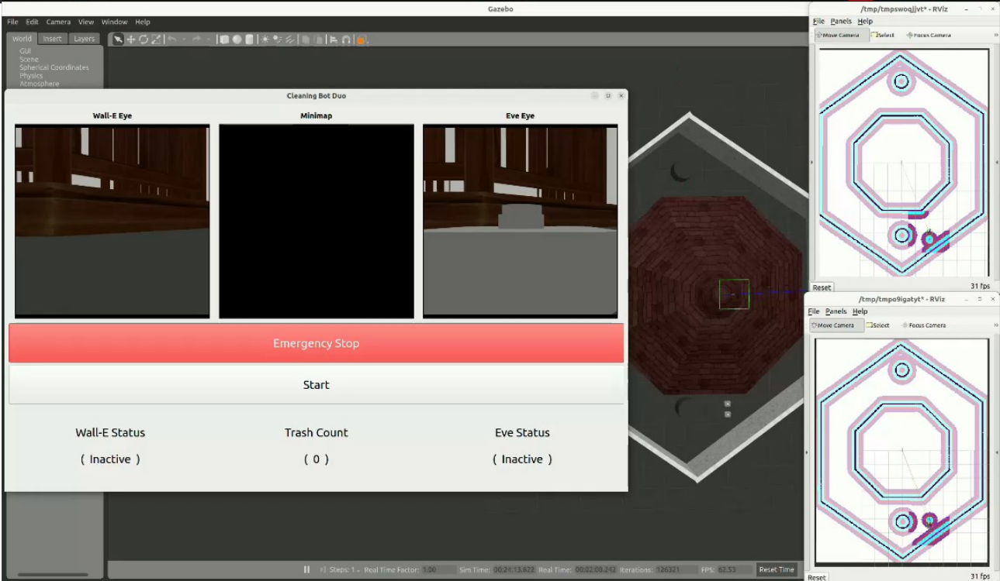

Description
===================
2개의 AMR 로봇이 공원주위를 돌아다닙니다. WALL-E 가 먼저 돌아다니며 쓰레기를 YOLO8로 객체인식합니다. WALL-E 가 매니퓰레이터로 집어서 뒤에 따라다니는 Eve 로봇의 바스켓에 담습니다. Eve 로봇은 터틀봇3 기본 모델에서 매니퓰레이터를 제거하고 뒤에 바스켓을 얹도록 URDF를 수정하였습니다. 

Ref Repo
============
2개 이상의 AMR봇을 rviz, gazebo 에서 스폰하기 위해 아래 리포지토리를 참조하였습니다.
```console
https://github.com/arshadlab/turtlebot3_multi_robot/
```

Captures
============






How to execute
====================
1. multitb_ws

```console
ros2 launch turtlebot3_walleva gazebo_multi_custom.launch.py
or ros2 launch turtlebot3_walleva gazebo_walleva.launch.py
```
2. amr_ws
```console
ros2 run move_to_goal move_to_goal
```
3. b3_ws
```console
ros2 run dual_bot gui_server
```
